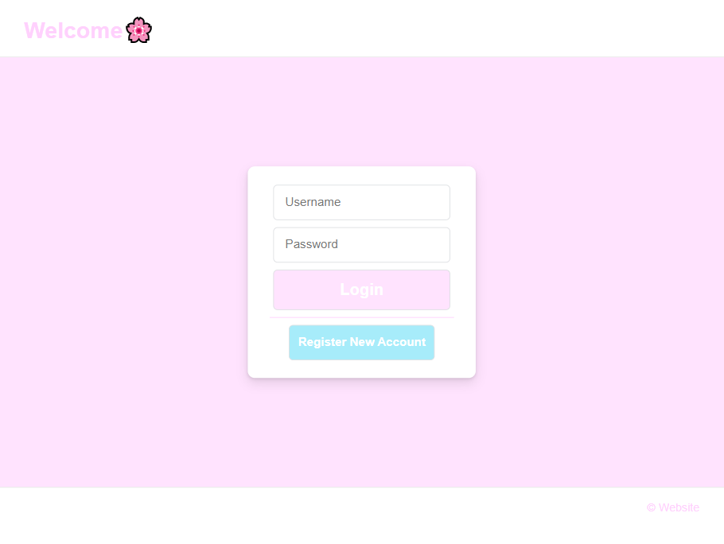
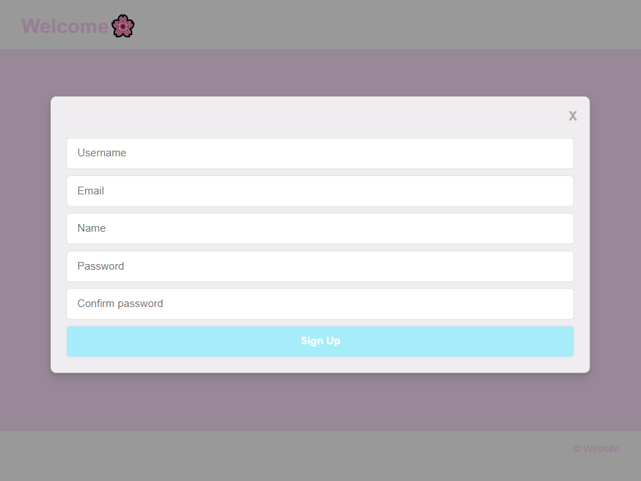
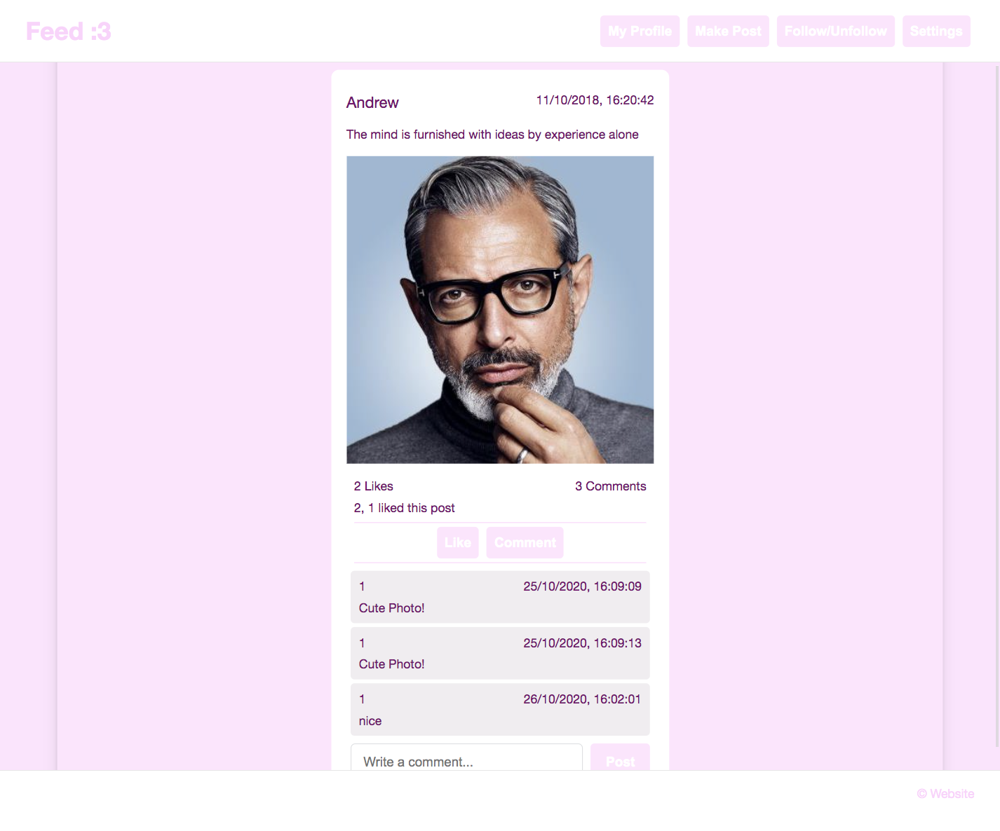
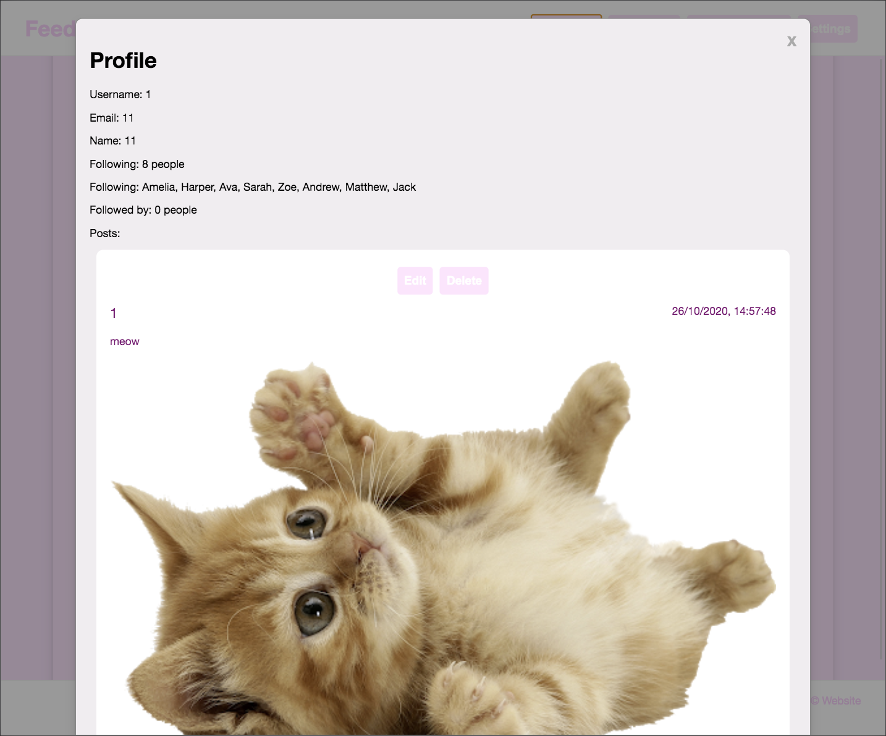
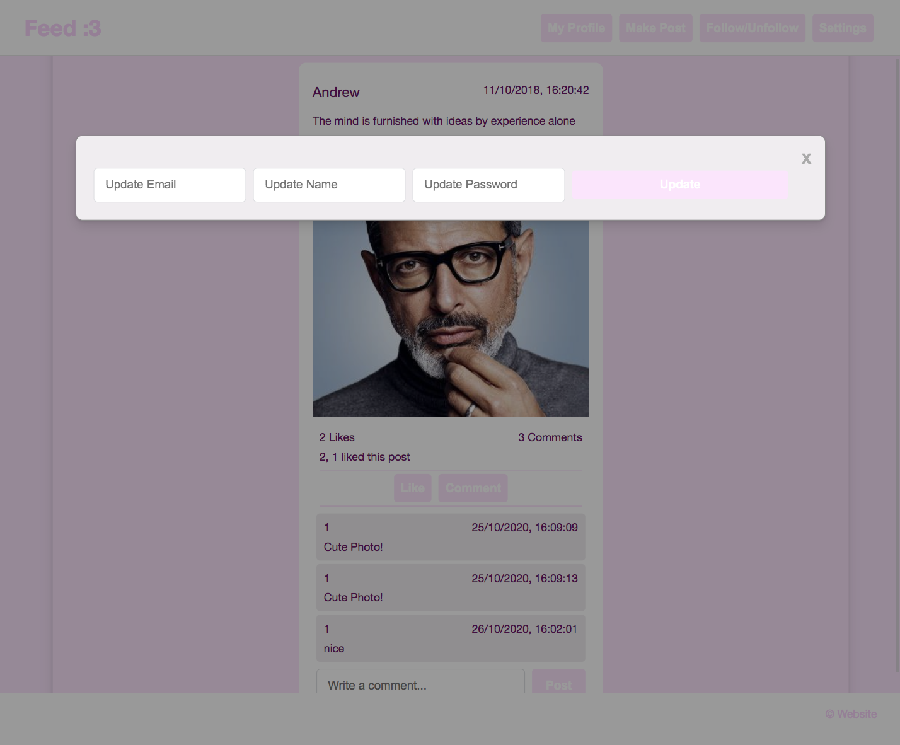
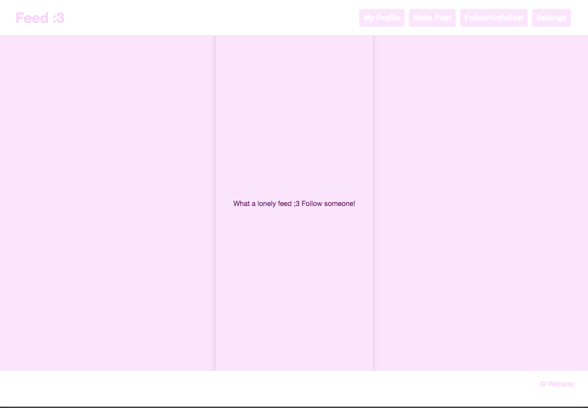

# VanillaJS-Website
A responsive website coded in VanillaJS with a python backend.  
Visually pleasing and cute website.  
A very similar structure to popular websites such as Facebook, Reddit etc.  

## Instructions
1. Clone the repository
2. To run the backend server, follow the README in the backend directory
3. To run the frontend server, run `python3 -m http.server` in the root directory

## Features
- Log in as a user using username and password
- Sign up as a new user with a username, email, name and password
- Entertain yourself with your news feed, filled with posts made by people you follow
- Like and comment on posts
- Check out your own profile
- Edit or delete posts that you made personally
- Make a post
- Follow/Unfollow people 
- Update/Change your email, name and password 

## Gallery
### Login Page

### Sign Up Form

### Feed Page

### Profile Page

### Settings

### Feed with no posts! Sad feed

